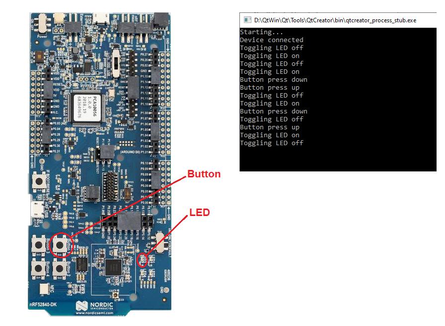

Qt Central / nRF52 Peripheral
=============================

**Description**

This is an example of a BLE central that runs on a PC or laptop, and communicates with a BLE peripheral that runs on an Nordic nRF52.  The central is a command line program that runs on any typical PC or laptop which has Bluetooth support and can run [Qt](https://www.qt.io/).  This has been tested on Windows 10 and Linux (Ubuntu).  The peripheral runs on a [Nordic nRF52840 Development Board](https://www.mouser.com/new/nordic-semiconductor/nordic-nRF52840-dev-kit/).  It's essentially [this Nordic example](https://infocenter.nordicsemi.com/topic/com.nordic.infocenter.sdk5.v14.2.0/ble_sdk_app_blinky.html).

 

**Hardware**
-   For the BLE Central: Any typical laptop or PC with Bluetooth that can run [Qt](https://www.qt.io/).
-   For the BLE Peripheral: [Nordic nRF52840 Development Board](https://www.mouser.com/new/nordic-semiconductor/nordic-nRF52840-dev-kit/)

 

**Building the Central**
-   Download and install [Qt](https://www.qt.io/) for open source users.
-   Start Qt Creator.
-   Load NordicCentral.pro and build.

 

**Building the Peripheral**
-   [Segger Embedded Studio](https://www.nordicsemi.com/Software-and-Tools/Development-Tools/Segger-Embedded-Studio)
-   [Nordic nRF5 SDK](https://www.nordicsemi.com/Software-and-Tools/Software/nRF5-SDK) 
-   BLE projects require flashing the Nordic SoftDevice to the nRF52 dev board.  Detailed info [here](https://infocenter.nordicsemi.com/topic/com.nordic.infocenter.sdk5.v15.2.0/getting_started_softdevice.html).

 

**Running**
- Start the nRF52 peripehral application running on the nRF52 development board.
- Run the NordicCentral project in Qt Creator.
- As shown in the image below, the central application will toggle the LED on the nRF52 board every two seconds.  When pressing the button on the nRF52 board, the Qt application will log when the button is pressed and released.

 

**Licensing**

The MIT License applies to all code authored by Terence M. Darwen within this repo:

*Copyright (c) 2020 Terence M. Darwen - tmdarwen.com*

*Permission is hereby granted, free of charge, to any person obtaining a copy of
this software and associated documentation files (the "Software"), to deal in
the Software without restriction, including without limitation the rights to
use, copy, modify, merge, publish, distribute, sublicense, and/or sell copies of
the Software, and to permit persons to whom the Software is furnished to do so,
subject to the following conditions:*

*The above copyright notice and this permission notice shall be included in all
copies or substantial portions of the Software.*

*THE SOFTWARE IS PROVIDED "AS IS", WITHOUT WARRANTY OF ANY KIND, EXPRESS OR
IMPLIED, INCLUDING BUT NOT LIMITED TO THE WARRANTIES OF MERCHANTABILITY, FITNESS
FOR A PARTICULAR PURPOSE AND NONINFRINGEMENT. IN NO EVENT SHALL THE AUTHORS OR
COPYRIGHT HOLDERS BE LIABLE FOR ANY CLAIM, DAMAGES OR OTHER LIABILITY, WHETHER
IN AN ACTION OF CONTRACT, TORT OR OTHERWISE, ARISING FROM, OUT OF OR IN
CONNECTION WITH THE SOFTWARE OR THE USE OR OTHER DEALINGS IN THE SOFTWARE.*
