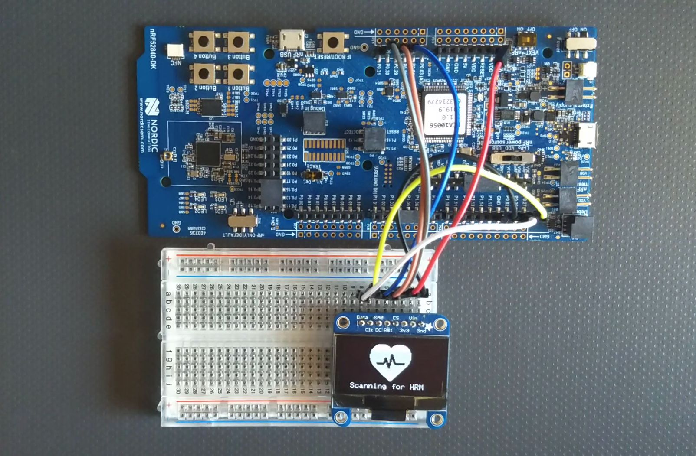

Nordic nRF52840 BLE Heart Rate Collector
========================================

A Bluetooth Low Energy (BLE) Heart Rate Collector using a Nordic nRF52840 development board.

More info about this project can be found on my website [here](http://www.tmdarwen.com/latest/ble-heart-rate-collector).

 

**Hardware**

-   [Nordic nRF52840 Development Board](https://www.mouser.com/new/nordic-semiconductor/nordic-nRF52840-dev-kit/)

-   [Adafruit Monochrome 1.3" 128x64 OLED Graphic Display](https://www.adafruit.com/product/938)

-   [Heart Rate Monitor Chest Strap](https://www.amazon.com/CooSpo-Fitness-Tracker-Waterproof-Bluetooth/dp/B07BS6B4PD)

 

**Building**

-   This project was built using [Segger Embedded Studio](https://www.nordicsemi.com/Software-and-Tools/Development-Tools/Segger-Embedded-Studio).

-   This project uses the [nRF5 SDK](https://www.nordicsemi.com/Software-and-Tools/Software/nRF5-SDK). 

-   Flashing the Nordic SoftDevice to the nRF52 dev board is required.  Detailed info [here](https://infocenter.nordicsemi.com/topic/com.nordic.infocenter.sdk5.v15.2.0/getting_started_softdevice.html).

 

**Licensing**

Aside from specific Nordic and Adafruit code, the MIT License applies to all code 
authored by Terence M. Darwen within this project:

*Copyright (c) 2019 Terence M. Darwen - tmdarwen.com*

*Permission is hereby granted, free of charge, to any person obtaining a copy of
this software and associated documentation files (the "Software"), to deal in
the Software without restriction, including without limitation the rights to
use, copy, modify, merge, publish, distribute, sublicense, and/or sell copies of
the Software, and to permit persons to whom the Software is furnished to do so,
subject to the following conditions:*

*The above copyright notice and this permission notice shall be included in all
copies or substantial portions of the Software.*

*THE SOFTWARE IS PROVIDED "AS IS", WITHOUT WARRANTY OF ANY KIND, EXPRESS OR
IMPLIED, INCLUDING BUT NOT LIMITED TO THE WARRANTIES OF MERCHANTABILITY, FITNESS
FOR A PARTICULAR PURPOSE AND NONINFRINGEMENT. IN NO EVENT SHALL THE AUTHORS OR
COPYRIGHT HOLDERS BE LIABLE FOR ANY CLAIM, DAMAGES OR OTHER LIABILITY, WHETHER
IN AN ACTION OF CONTRACT, TORT OR OTHERWISE, ARISING FROM, OUT OF OR IN
CONNECTION WITH THE SOFTWARE OR THE USE OR OTHER DEALINGS IN THE SOFTWARE.*
